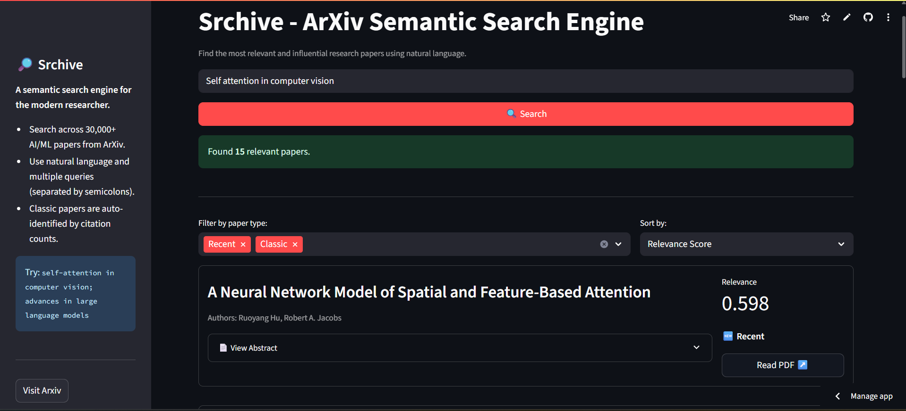
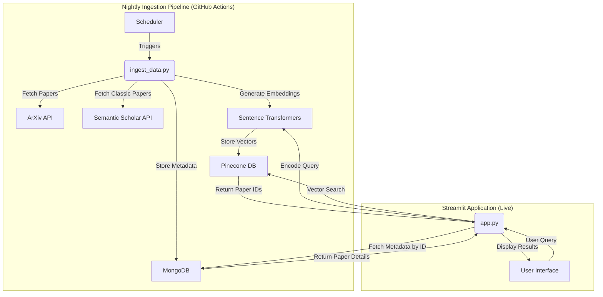

# Srchive: A Semantic Search Engine for ArXiv

[Website](https://srchive.streamlit.app/)

**Srchive** is an intelligent search engine that allows users to perform semantic, natural language queries across a database of over 30,000 recent and classic research papers from ArXiv. Built with a modern data stack, it leverages vector embeddings to understand the *meaning* behind a query, not just keywords.

-----


## 🚀 Features

  - **Semantic Search**: Go beyond keywords. Search for concepts like `"using transformers for image classification"` and get relevant results.
  - **Massive & Curated Database**: A collection of over 30,000 papers, including the most recent pre-prints and highly-cited classic papers in AI, ML, NLP, and CV.
  - **Multi-Query Support**: Ask multiple questions at once by separating them with a semicolon (`;`).
  - **Interactive UI**: A clean and responsive interface built with Streamlit, allowing users to filter and sort results on the fly.
  - **Automated Daily Updates**: A GitHub Actions workflow runs nightly to ingest the latest papers from ArXiv, ensuring the database stays current.

-----

## Architecture

The project consists of two main components: a nightly data ingestion pipeline and a real-time search application.



-----

## 🛠️ Local Setup and Installation

To run this project on your local machine, follow these steps.

### Prerequisites

  - Python 3.11 or higher
  - Git
  - [UV](https://github.com/astral-sh/uv) (for package management)

### 1\. Clone the Repository

```bash
git clone https://github.com/ap-aditya/srchive
cd srchive
```

### 2\. Set Up Environment Variables

Create a file named `.env` in the root of the project and add the following credentials. These are essential for connecting to the database and services.

```env
# .env.example

# Get from https://app.pinecone.io/
PINECONE_API_KEY="your_pinecone_api_key"

# Get from MongoDB
MONGO_URI="your_mongodb_connection_string"

# Optional, but recommended. Get from https://huggingface.co/settings/tokens
HF_TOKEN="your_huggingface_read_token"
```

### 3\. Install Dependencies

This project uses `uv` for fast and reliable dependency management.

```bash
# Install uv if you haven't already
pip install uv

# Sync the environment with the lock file
uv sync
```

### 4\. Populate the Database

Before running the app, you must populate your Pinecone and MongoDB databases using the ingestion script.

**Warning**: This process is lengthy and will consume API quotas. It may take several minutes to complete for the first time.

```bash
python ingest_data.py
```

### 5\. Run the Streamlit App

Once the data ingestion is complete, you can launch the web application.

```bash
streamlit run app.py
```

-----
 
## ☁️ Deployment

This application is designed for easy deployment on **Streamlit Community Cloud**.

1.  **Push your code** to a GitHub repository.
2.  Go to [share.streamlit.io](https://share.streamlit.io) and sign in.
3.  Click "**New app**" and select your repository and branch.
4.  In the "**Advanced settings**", add the same secrets from your `.env` file (`PINECONE_API_KEY`, `MONGO_URI`, `HF_TOKEN`).
5.  Click "**Deploy**"\!

-----

## 🔄 Automated Data Ingestion

The repository includes a GitHub Actions workflow defined in `.github/workflows/ingest.yml`.

  - **Trigger**: This workflow runs automatically every night at `18:30 UTC` (00:00 IST). It can also be triggered manually from the Actions tab in GitHub.
  - **Function**: It executes the `ingest_data.py` script to fetch new papers, ensuring the app's database grows and stays up-to-date.
  - **Configuration**: For this to work in your forked repository, you must add the `PINECONE_API_KEY`, `MONGO_URI`, and `HF_TOKEN` as **repository secrets** under `Settings > Secrets and variables > Actions`.

-----

## 🤝 Contributing

Contributions are welcome\! If you have suggestions for improvements or new features, please feel free to:

1.  Fork the repository.
2.  Create a new feature branch (`git checkout -b feature/AmazingFeature`).
3.  Commit your changes (`git commit -m 'Add some AmazingFeature'`).
4.  Push to the branch (`git push origin feature/AmazingFeature`).
5.  Open a Pull Request.

-----

## 🙏 Acknowledgements

  - [ArXiv](https://arxiv.org/) for providing the data.
  - [Semantic Scholar](https://www.semanticscholar.org/) for their powerful academic graph API.
  - [Pinecone](https://www.pinecone.io/) for the scalable vector database.
  - [MongoDB](https://www.mongodb.com/) for metadata storage.
  - [Hugging Face](https://huggingface.co/) for the Sentence Transformers library.
  - [Streamlit](https://streamlit.io/) for making data app creation so seamless.